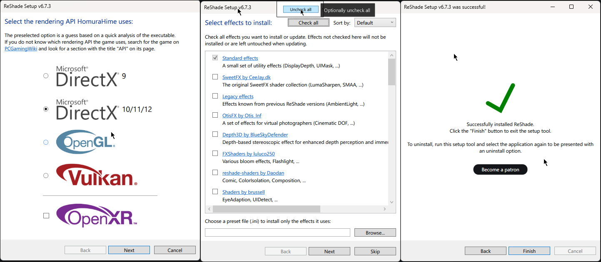
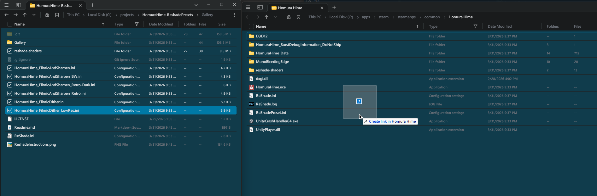
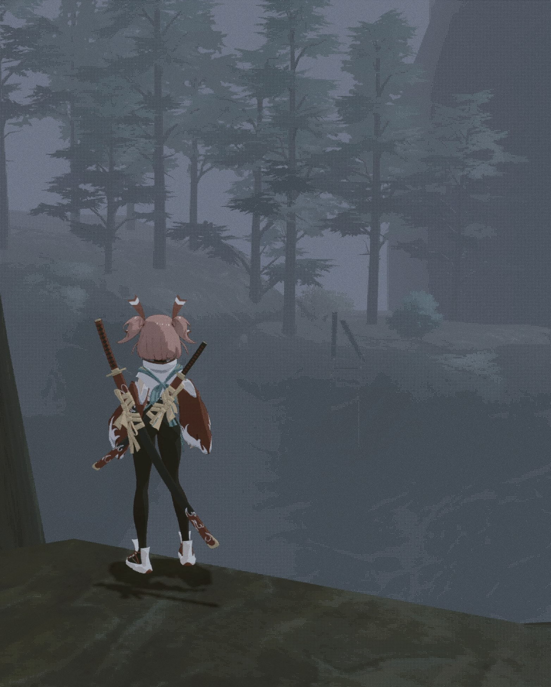
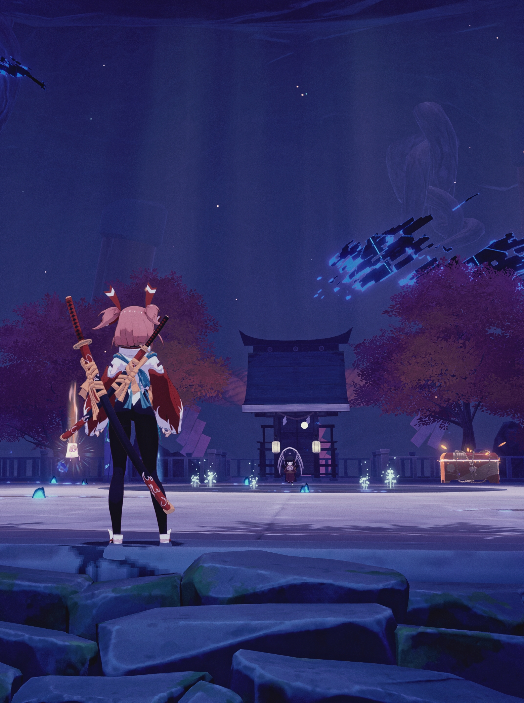
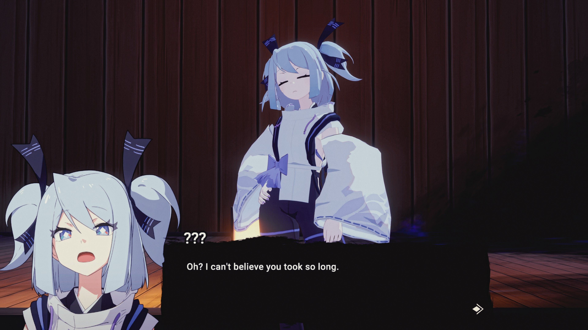

# Homura Hime Reshade Presets

## Instructions

1. Download the latest version of Reshade from the official website: https://reshade.me/
2. Install reshade to Homura Hime app install location or [ShaderGlass](https://github.com/mausimus/ShaderGlass)
   * 
3. Drag and drop desired presets and dependent reshade-shaders directory to installed reshade directory
   * 
   

## Quick Reference

## Filmic and Sharpen

## Filmic and Sharpen B&W

## Filmic Dither

## Filmic and Sharpen Retro

